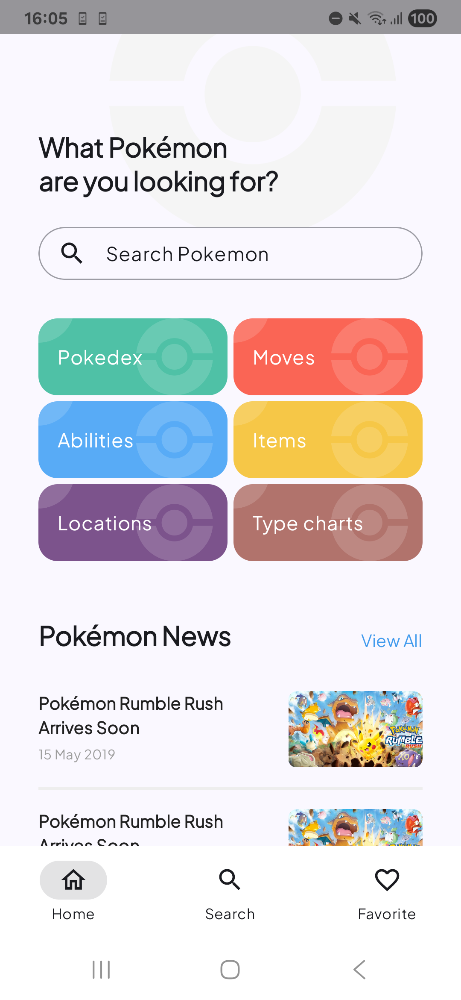
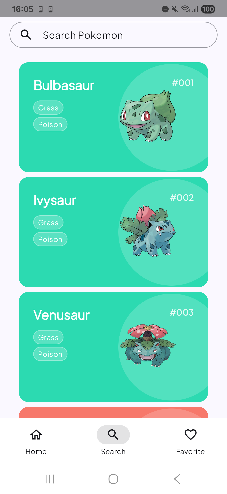
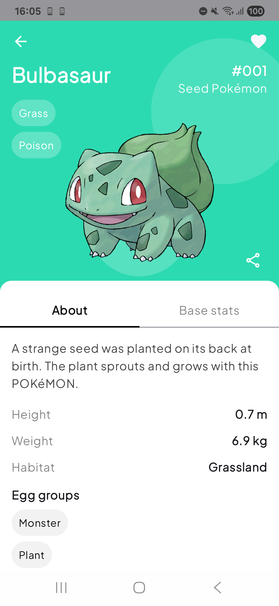

# PokeApp

A modern Pokédex built with Jetpack Compose.
Single-Activity architecture (no Fragments), clean UI, search, favorites, and background sync.

## Screenshots
| Home | Search | Detail|
|---|---|---|
|  |  |  |


## Features
- **Explore Pokémon**: Browse a comprehensive list of Pokémon with endless scrolling.
- **View Pokémon Details**: See detailed information about each Pokémon, including their stats, types, and abilities.
- **Search**: Quickly find any Pokémon by its name.
- **Favorites**: Mark your favorite Pokémon and access them easily in a dedicated list.


## Tech Stack
- **UI**: [Jetpack Compose](https://developer.android.com/jetpack/compose) with Material 3.
- **Architecture**: MVVM with Clean Architecture principles.
- **DI**: [Koin](https://insert-koin.io/).
- **Concurrency**: Kotlin Coroutines & Flow.
- **Navigation**: [Navigation Compose](https://developer.android.com/jetpack/compose/navigation).
- **Networking**: [Retrofit](https://square.github.io/retrofit/) & OkHttp.
- **Persistence**: [Room](https://developer.android.com/training/data-storage/room) for local database.
- **Background work**: [WorkManager](https://developer.android.com/topic/libraries/architecture/workmanager).
- **Images**: Coil.

## Architecture
This project follows the principles of Clean Architecture with a presentation layer based on MVVM. It separates the code into three main layers: `domain`, `data`, and `presentation` (ui).

- **Domain Layer**: Contains the core business logic, including models, use cases and repository interfaces. This layer is independent of any framework.
- **Data Layer**: Implements the repository interfaces defined in the domain layer. It's responsible for managing data from remote (Retrofit) and local (Room) data sources.
- **Presentation (UI) Layer**: Displays the data on the screen using Jetpack Compose. It consists of ViewModels that provide state to the UI and handle user events.

## Project Structure

```
app/
├── core/         # Core components (network, database, logging)
├── data/         # Repositories, data sources (remote/local), mappers and DTOs
│   ├── datasource/ # Remote and Local data sources
│   ├── mapper/     # Mappers from DTOs to domain models
│   └── repository/ # Implementation of the domain repositories
├── di/           # Koin dependency injection modules
├── domain/       # Business logic (use cases, models, repository interfaces)
│   ├── model/      # Domain models
│   ├── repository/ # Repository interfaces
│   └── usecase/    # Business logic Use Cases
├── navigation/   # Navigation logic using Navigation Compose
├── ui/           # Jetpack Compose screens and ViewModels
│   ├── components/
│   ├── pokemondetail/
│   ├── pokemonlist/
│   └── ...
└── utils/        # Utility classes and functions
```

## Setup

1. **Clone the repository**
   ```bash
   git clone https://github.com/anibalestebanc/pokedex_android.git
   cd pokedex_android
   ```

2. **Open in Android Studio**
    - Launch Android Studio


3. **Configure local properties** (if needed)
   ```properties
   # local.properties
   sdk.dir=/path/to/your/Android/sdk
   ```

4. **Build the project**
   ```bash
   ./gradlew build
   ```
## Running the App

### On Emulator
1. Create an AVD (Android Virtual Device) with API 26+
2. Click "Run" in Android Studio or use:
   ```bash
   ./gradlew installDebug
   ```

### On Physical Device
1. Enable Developer Options and USB Debugging
2. Connect device via USB
3. Run the app from Android Studio

## Development Workflow

### Running Tests
```bash
# Run all unit tests
./gradlew test

# Run tests for specific module
./gradlew :app:test

# Run instrumented tests
./gradlew connectedAndroidTest
```

### Code Quality Checks
```bash
# Run all quality checks
./gradlew check

# Run Detekt static analysis
./gradlew detekt

# Run Android Lint
./gradlew lint
```

### Building Release APK
```bash
./gradlew assembleRelease
````

## References
- This project is an improvement/adaptation of:
  - compose-pokedex: [zsoltk/compose-pokedex](https://github.com/zsoltk/compose-pokedex)
- Architecture and best-practice inspiration from:
  - Now in Android: [android/nowinandroid](https://github.com/android/nowinandroid)

## License
This project is licensed under the MIT License - see the [LICENSE](LICENSE) file for details.
